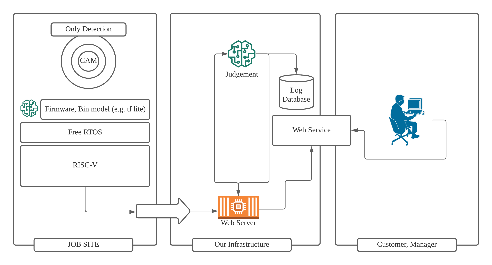

# References

### 📘 [Tensorflow Lite in Zephyr on LiteX/VexRiscv](https://antmicro.com/blog/2019/12/tflite-in-zephyr-on-litex-vexriscv/)
Google’s TensorFlow Lite, a smaller brother of one of the world’s most popular Machine Learning frameworks, is focused on exactly that – running neural network inference on resource constrained devices

### 📘 [riscv-isa-sim](https://github.com/riscv/riscv-isa-sim)
RISC V를 시뮬레이션 할 수 있는 Spike 시뮬레이터.

### 📘 [Tensorflow lite demo running in Zephyr on Litex/VexRiscv SoC](https://github.com/antmicro/litex-vexriscv-tensorflow-lite-demo)
아주 친절하게 마련된 튜토리얼.

### 📘 [AI on a microcontroller with TensorFlow Lite and SparkFun Edge](https://codelabs.developers.google.com/codelabs/sparkfun-tensorflow/#0)
Sparkfun edge tensorflow 튜토리얼인데 100% 절대 안 될거임. 드라이버를 수정 해야하는데 [CH341SER](https://github.com/juliagoda/CH341SER) 이것이 필요 할 것임

### 📘 [TensorFlow’s Object Detection API Using Google Collab.](https://medium.com/swlh/tensorflows-object-detection-api-using-google-collab-cb92d7f7b3cf)
From naver

# Paper

Applying the Haar-cascade Algorithm for Detecting Safety Equipment in Safety Management Systems for Multiple Working Environments
공사현장에서 안전장치 Detection에 관한 논문이다.

# Companies
## AI Supervisor로 건설현장 감독 서비스르 제공하는 업체들

[How Shawmut Design & Construction is minimizing risk to construct with confidence](https://youtu.be/MfLPEvEMtlM?t=1727)
단순히 안전고리 확인에 그치지 않고 공사의 종류, 리스크, 안전 장치 유무를 종합적으로 판단 현장 위험을 전반적으로 감독하는 단계까지 왔다. Vinnie는 공사 현장의 리스크를 분석하는 AI다.

- 📰 https://www.smartvid.io/ai-in-construction-blog/who-is-vinnie
- 📰 https://www.hannovermesse.de/en/news/news-articles/ai-engine-vinnie-to-warn-of-accidents

